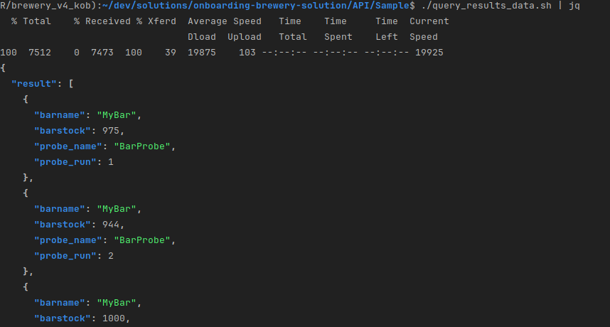
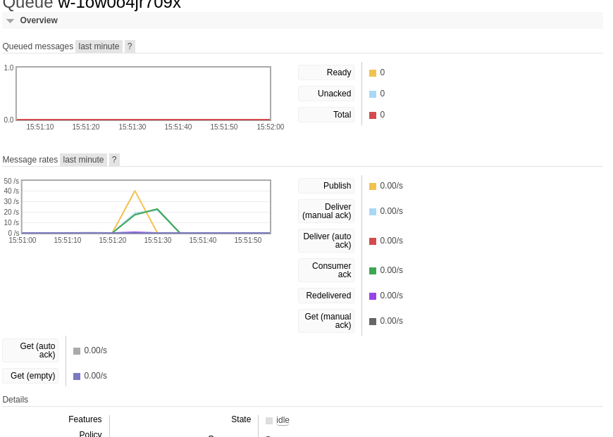
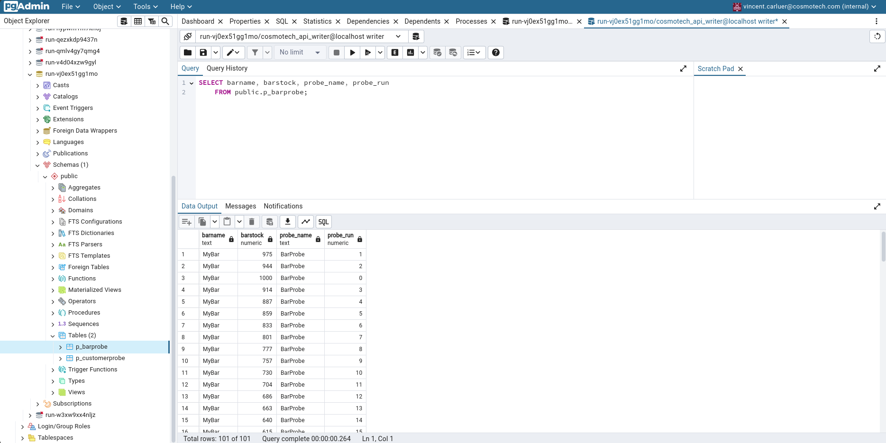

# SAMPLE API DOCUMENTATION
This is the documentation to make the sample run template of the brewery solution runs on the Cosmo Tech platform.

You need at least version 4.0.4-onprem to run this sample.

This tutorial is based on the usage of an API KEY, please refer to the Cosmo Tech [Platform installation helm help](https://artifacthub.io/packages/helm/cosmotech-api/cosmotech-api#optional-configure-an-api-key) to configure it.

The Cosmo Tech brewery simulator used in this tutorial is publicly available here: https://github.com/Cosmo-Tech/onboarding-brewery-solution/pkgs/container/brewery_simulator

You need at least tag 0.0.10 of the brewery image simulator to run this sample.

## Setting environment variables
copy set_env_sample.sh to set_env.sh and fill the three following variables:
``` bash
export USER_EMAIL=changeme.email@company.com
export API_KEY=my_api_key_changeme
export BASE_URL=https://cosmotech-api-url-tenant-changeme
```

During this sample you will complete this set_env.sh file with the correct values.

## Create the platform resources
``` bash
cd API/Sample
```
Execute the commands one by one and copy each time the generated id to the set_env.sh file.

This sample does not need any input dataset.
### Organization
``` bash
./create_organization.sh
```
### Solution
``` bash
./create_solution.sh
```
### Workspace
``` bash
./create_workspace.sh
```
### For _sample_rds_direct_ run_template
sample_rds_direct run template use connection to the Cosmo Tech Platform RDS server.

In order to authentify to the API it must use the API Key defined in this example.

Create a CSM_API_KEY secret at the workspace level:
``` bash
./create_workspace_api_key.sh
```
### Scenario
``` bash
./create_scenario.sh
```
## Run the simulation and get the results
Run the scenario
``` bash
./run.sh
```
### For _sample_ run_template
Query the bar probe with stock level:
``` bash
./query_results_data.sh
```
### For _sample_rds_direct_ run_template
Query the bar probe with stock level with custom data (sample_rds_direct run template):
``` bash
./query_custom_data.sh
```

### For _sample_postgres_direct_ run_template
Query directly the external Postgres Database

### Result direct access
#### RabbitMQ
If you have setup an external rabbitmq server, you can add a consumer to get the results message directly from the workspace queue.

#### Result Data Service + external Postgres
If you have setup an external postgres database in result data service, you can query the results directly from it with the reader user defined in the Platform configuration.
Tables are prefixed with the 'p_' string before the name of the probe in lowercase, here p_barprobe.
``` sql
SELECT * FROM public.p_barprobe;
```

#### External Postgres
If you have setup an external postgres database in result data service, you can query the results directly with postgres client.
Tables are prefixed with organization id, workspace id and run id.
``` sql
SELECT id, run_id, simulationrun, probeinstance, proberun, customername, customersatisfaction
	FROM csm.o_d101zx7rp18r_w_1ow0o4jr709x_r_304vrk0e2y4l_customerprobe;
```

## Optional: Build the image yourself
In order to build you own brewery image you need to install the Cosmo Tech SDK and run the following command:
``` bash
csm clean
csm build
csm docker build
```

You can then either publish the image with:
``` bash
csm docker release ...
```
or direct docker push command:
``` bash
docker tag...
docker push...
```
You need to change the repository and version defined in the create_solution.yaml file.
